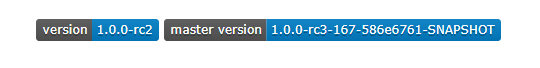

This document discusses all things Spark. The purpose of this document is to answer any and all questions [FIFE](https://github.com/IDA-HumanCapital/fife) users may have when transitioning to fifeforspark.

## What is Apache Spark?
Simply put, Apache Spark is a software language that supports cluster computation towards analytical tasks. A **cluster** is a collection of computers which are operated cohesively to perform a computational task. Each computer in a cluster is referred to as a **node**1. In the context of Spark, clusters include several **worker nodes** and a single **driver program**. The driver is a central unit that assigns jobs to each worker. Each worker node has atleast one **executor**, tasked with completing the jobs2. 

## What is PySpark?
While the original Apache Spark is written in Scala, PySpark is a package which extends Apache Spark functionality to Python. Neccessary for this is the Py4J package, which allows Python to interact with Java Virtual Machine (JVM) objects. In conclusion, PySpark creates a Python API for Apache Spark3, this allows for the development and application of fireforspark within Python and thus maintains a consistent programming language with the original FIFE.

## Spark and FIFE
The primary benefits of applying Apache Spark (and Cluster computation in general) is scalability. For our purpose, this is the ability to analyze larger datasets than a singular computer could have on it's own. This can be neccesary for one of two reasons:   
* The process is computationally expensive and takes far longer to run on a single computer than what is reasonable
* The dataset is too large, and requires more memory than a singular computer is capable of storing or computing on 

Both these reasons are directly relevant to the context of FIFE. By developing fifeforspark, we hope to extend the power of FIFE's forecasting and retention prediction capabilities towards larger datasets and in turn, bypass any previous restrictions and memory errors. In cases where users have only been able to run FIFE on a subset of their data, fifeforspark allows these users to apply the full extent of their dataset towards training and prediction. This allows users to account for more features and data records, with the end goal of improving overall model quality.

## How to download MMLSpark
**MMLSpark** is a spark-compatible machine learning package developed by Microsoft4.
MMLSpark provides a distributed version of LightGBM, the gradient boosting package which FIFE utilizes. Therefore, MMLSpark is a required package for fifeforspark to operate. We focus our discussion on how to download MMLSpark on Databricks.

While there exists a PyPi page for MMLSpark and it is possible to pip install MMLSpark, we recommend that you do not download MMLSpark in this way. This is because the version of MMLSpark available on PyPi has not been updated, and is not compatible with the current versions of Python, Spark, and Scala. Attempting to utilize fifeforspark with the PyPi verson of MMLSpark will display an error similar to the following5 :

 ModuleNotFoundError: No module named 'mmlspark.lightgbm._LightGBMClassifier' 
  

 

To download the newest version of MMLSpark, we recommend that you utilize the newest Maven coordinates available on the [MMLSpark GitHub repository](https://github.com/microsoft/SynapseML). The README page on their GitHub contains both the current version number, and Maven coordinates (labeled as 'master version'). This is shown below:   

   

 In Databricks, initialize a new library within the Workspace and in the desired location. A guide for performing this can be observed from the following [link](https://docs.microsoft.com/en-us/azure/cognitive-services/big-data/getting-started#azure-databricks)6, but we also outline the process in the below steps:

1. Once on Databricks, click on the Workspace button located in the left-hand panel
2. Right-click anywhere within the Workspace
3. Hover over the 'Create' button, then click on 'Library'
4. Once in the library creation menu, change the 'Library Source' to Maven

Within Maven, you will see inputs for the 'Coordinates' and 'Repository'. The MMLSpark Maven coordinates are a combination of a prefix, the current Scala version, and the current master verison mentioned above. A general format and the current Maven Coordinates format are both displayed below:
* General Maven Coordinates: com.microsoft.ml.spark:mmlspark_ _**insert_current_scala_version**_ : _**insert_current_master_version**_

* Current Maven Coordinates: com.microsoft.ml.spark:mmlspark_2.12:1.0.0-rc3-167-586e6761-SNAPSHOT

The above Maven Coordinates only represent the most recent version as of when this guide was written. The Maven Repository will always remain the same:
* Maven Repository: https://mmlspark.azureedge.net/maven 

## Frequently Asked Questions

## Sources
1. https://researchcomputing.princeton.edu/faq/what-is-a-cluster 
2. http://spark.apache.org/docs/latest/cluster-overview.html
3. https://databricks.com/glossary/pyspark
4. https://github.com/microsoft/SynapseML
5. https://github.com/microsoft/SynapseML/issues/718
6. https://docs.microsoft.com/en-us/azure/cognitive-services/big-data/getting-started#azure-databricks